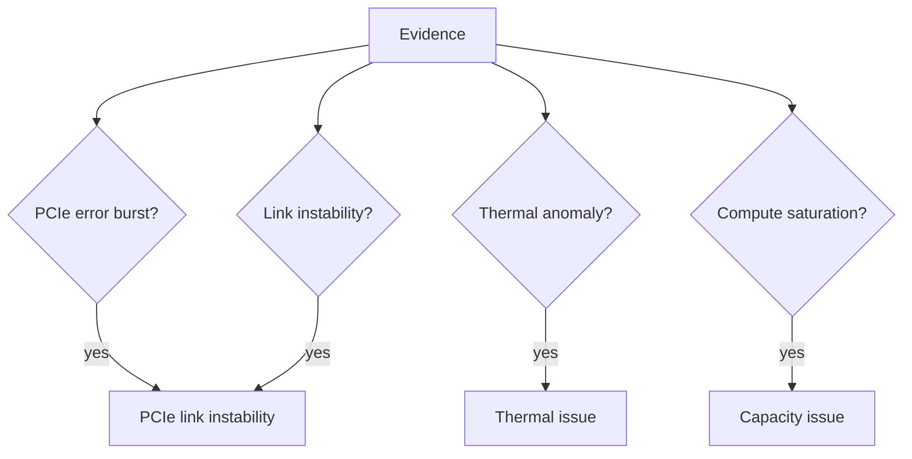

# Architecture

The engine is a deterministic pipeline. One telemetry fixture in, one
reproducible incident report out.

## Failure classification

Each fixture carries correlation evidence; the engine passes or fails each
check and derives a root cause with a confidence score.

## Design principles

- **Deterministic**: same fixture → same report, every time.
- **No runtime dependencies**: stdlib only, no web UI, no metrics server.
- **Separation of concerns**: telemetry (fixtures) vs. reasoning (engine) vs.
  output (report).
